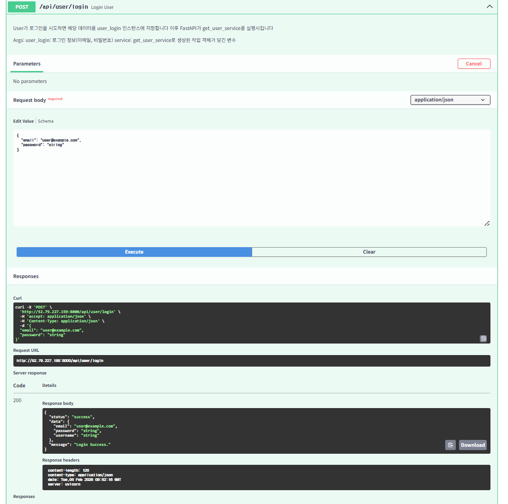
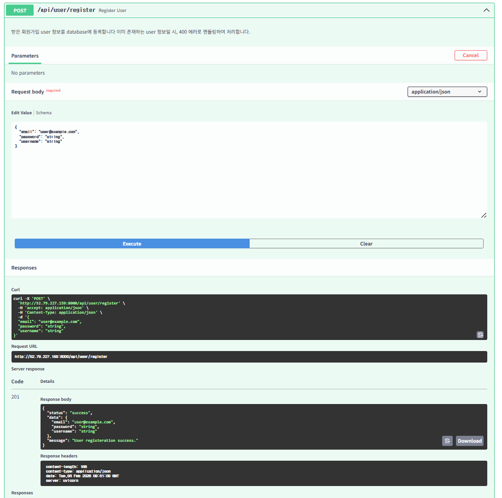
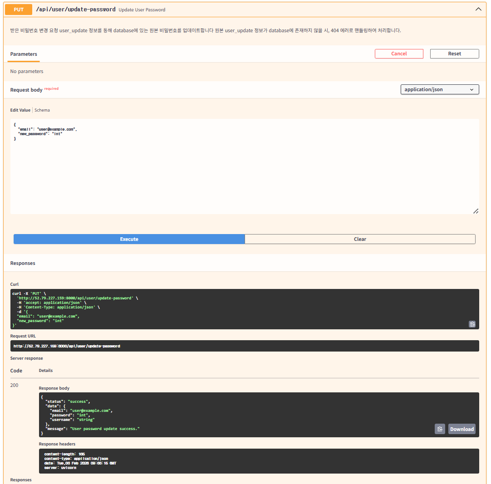
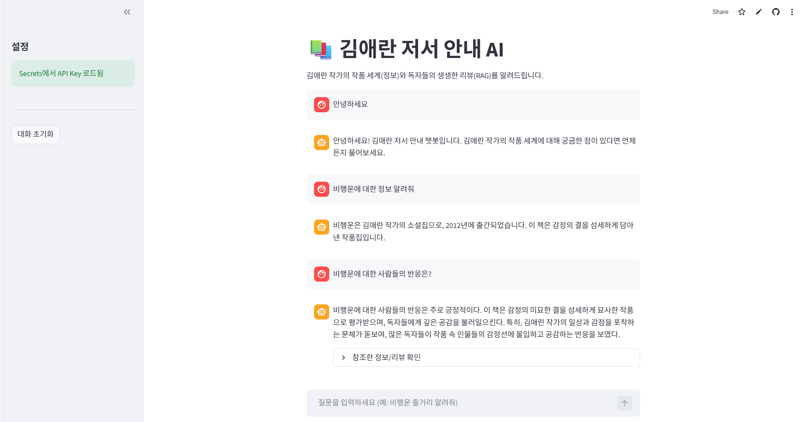

 자기소개 및 팀 소개 

안녕하세요 컴퓨터과학과 24학번 오유림입니다! 나이는 05년생이고 취미는 그림 그리기입니다. 잘 부탁드립니다!
안녕하세요 응용통계학과 22학번 장준한입니다! 나이는 03년생이고 취미는 볼링 치는 것입니다. 잘 부탁드려요!
22학번 24살 응용통계학과 최재형입니다 밴드 음악 좋아합니다 열심히 하겠습니다!

저희 팀은 YBIGTA 신입 기수로서 방학 세션 동안 하나의 팀을 이루어, 주어진 세션 과제를 단순히 완수하는 데에 그치지 않고 과제의 목적과 학습 의도를 충분히 이해하고자 노력하며 성실하게 수행하고 있습니다. 각 팀원은 데이터 수집, 전처리, 분석 및 결과 정리의 전 과정에 적극적으로 참여하며, 개인의 역할에만 국한되지 않고 서로의 작업을 공유하고 피드백하는 과정을 통해 팀 전체의 완성도를 높이는 방향으로 협업하고 있습니다.


 Web 

본 프로젝트는 FastAPI 기반의 사용자 관리 웹 애플리케이션으로, 회원가입, 로그인, 비밀번호 변경, 사용자 삭제 기능을 제공한다. 프로젝트를 실행하기 위해서는 Python 3.9 이상 환경이 필요하며, 가상환경 구성을 통해 패키지 충돌을 방지하는 것을 권장한다.

프로젝트 실행 전, 먼저 프로젝트 루트 디렉토리에서 Python 가상환경을 생성한다. Python이 설치된 환경에서 python -m venv venv 명령어를 실행하면 venv라는 이름의 가상환경이 생성된다. 가상환경 생성 후, Windows 환경에서는 venv\Scripts\activate 명령어를 사용하여 가상환경을 활성화하고, macOS 또는 Linux 환경에서는 source venv/bin/activate 명령어를 사용하여 가상환경을 활성화한다. 가상환경이 정상적으로 활성화되면 터미널 프롬프트에 가상환경 이름이 표시된다.

가상환경 활성화 이후에는 프로젝트 실행에 필요한 라이브러리를 설치한다. 프로젝트 루트 디렉토리에 위치한 requirements.txt 파일을 기준으로 pip install -r requirements.txt 명령어를 실행하면 FastAPI, uvicorn, pytest 등 프로젝트에 필요한 모든 패키지가 자동으로 설치된다.

패키지 설치가 완료되면 FastAPI 서버를 실행할 수 있다. 프로젝트 루트 디렉토리에서 python app/main.py 명령어를 실행하면 서버가 시작되며, 내부적으로 uvicorn을 통해 FastAPI 애플리케이션이 실행된다. 서버는 기본적으로 8000번 포트를 사용하며, 실행 중 콘솔에 서버 시작 로그가 출력된다.

서버가 정상적으로 실행되면 웹 브라우저에서 http://localhost:8000 주소로 접속할 수 있다. 정적 HTML 파일은 /static/index.html 경로에 마운트되어 있으며, 브라우저에서 http://localhost:8000/static/index.html로 접속하여 확인할 수 있다. 사용자 관련 API는 /api/user 경로 하위에 구성되어 있으며, /api/user/register, /api/user/login, /api/user/update-password, /api/user/delete 엔드포인트를 통해 회원 관리 기능을 수행할 수 있다.

본 프로젝트는 JSON 파일을 기반으로 사용자 정보를 관리한다. 사용자 데이터는 프로젝트 루트의 database 디렉토리에 위치한 users.json 파일에 저장되며, 회원가입, 비밀번호 변경, 삭제 요청 시 해당 파일이 갱신된다. 서버 실행 전 users.json 파일이 존재하지 않거나 경로가 올바르지 않을 경우 정상 동작하지 않을 수 있으므로, database 디렉토리와 users.json 파일이 존재하는지 확인해야 한다.

기능 검증을 위해 pytest 기반의 테스트 코드가 함께 제공된다. 서버 실행과는 별도로 프로젝트 루트 디렉토리에서 pytest 명령어를 실행하면 user_service 및 user_router에 대한 단위 테스트와 API 테스트가 자동으로 수행된다. 모든 테스트가 통과할 경우 구현된 기능이 정상적으로 동작함을 확인할 수 있다.

본 프로젝트는 수업 과제 및 학습 목적을 위해 작성되었으며, FastAPI의 의존성 주입 구조와 계층 분리(Service–Repository 패턴)를 이해하는 것을 목표로 한다. 실행 환경이나 라이브러리 버전에 따라 동작이 달라질 수 있으며, Python 및 패키지 버전 차이로 인한 오류가 발생할 수 있다.

 Crawling 
1. <reviews_enuri.csv>
본 데이터는 가격 비교 사이트 에누리(Enuri, https://www.enuri.com)의 상품 상세 페이지에 게시된 사용자 리뷰를 웹 크롤링 방식으로 수집한 것이다. 수집 대상 URL은 https://www.enuri.com/detail.jsp?modelno=40629426이며, 공개적으로 제공되는 리뷰 정보를 기반으로 텍스트 분석 및 평점 분석을 위한 학습 및 과제 목적의 데이터셋 구축을 목표로 한다.

리뷰 데이터는 Python 기반 웹 크롤링으로 수집되었으며, Selenium WebDriver를 사용해 동적 페이지를 로딩한 뒤 리뷰 요소를 탐색하여 정보를 추출하였다. 크롤링 속도 향상을 위해 Headless 모드로 실행하고, 이미지 로딩을 차단하며(page에서 imagesEnabled=false), 페이지 로딩 전략을 eager로 설정하여 HTML 로드 이후 빠르게 파싱을 시작하도록 최적화하였다.

수집 항목은 리뷰 1건당 1행으로 구성되며, 주요 필드는 리뷰 평점(rating), 작성일(date), 리뷰 본문(content)이다. 리뷰 본문은 span.tx_sub 요소에서 추출하고, 평점은 p.tx_aval 요소에서 추출한다. 작성일은 리뷰 영역 내부의 텍스트 중 날짜 형식(예: YYYY.MM.DD)으로 판단되는 값을 탐색하여 저장한다.

본 크롤러는 목표 수집 개수를 500개로 설정하여(target_count = 500) 리뷰를 순차적으로 수집하며, 페이지네이션을 통해 다음 페이지로 이동한다. 다음 페이지 이동은 (1) 페이지 번호 버튼(button.p_num) 클릭을 우선 시도하고, 실패 시 (2) 다음(>) 버튼(button.btn.btn__next) 클릭을 시도하는 방식으로 구현되어 있다. 더 이상 이동 가능한 페이지가 없으면 수집을 종료한다.

수집된 데이터는 프로젝트 루트의 database 폴더에 CSV 파일로 저장된다. 저장 파일명은 reviews_Enuri.csv이며, UTF-8-SIG 인코딩으로 저장되어 한글 깨짐을 방지한다. 저장 로직은 현재 파일 경로 기준으로 프로젝트 루트를 계산한 뒤 database 폴더가 없으면 생성하고, pandas DataFrame으로 변환 후 CSV로 출력한다.

크롤링 실행을 위해 Python 3.9 이상 환경이 필요하며, selenium, pandas 라이브러리가 요구된다. 실행 시 WebDriver(Chrome)가 필요하며, 크롤링 스크립트 실행 후 scrape_reviews()로 데이터를 수집하고 save_to_database()를 호출하면 database/reviews_Enuri.csv 파일이 생성된다. 본 데이터는 수업 과제 및 학습 목적에 한해 사용되며, 사이트 구조 변경 또는 접근 제한 정책에 따라 정상적으로 동작하지 않을 수 있다.

2. <reviews_lotteon.csv>
본 데이터는 온라인 쇼핑몰 롯데온(LOTTE ON)의 상품 상세 페이지에 게시된 사용자 리뷰를 웹 크롤링 방식으로 수집한 것이다. 공개적으로 제공되는 리뷰 정보를 대상으로 하였으며, 텍스트 분석 및 평점 분석을 위한 학습 및 과제 목적의 데이터셋 구축을 목표로 한다.

수집된 데이터 파일은 reviews_Lotteon.csv이며, CSV 형식(UTF-8 인코딩)으로 저장되어 있다. 데이터는 리뷰 1건당 1행으로 구성되어 있으며, 총 500개의 리뷰가 포함되어 있다.

데이터는 총 3개의 컬럼으로 구성되어 있다. star 컬럼은 리뷰 평점을 나타내며 1점부터 5점까지의 정수값을 가진다. date 컬럼은 리뷰가 작성된 날짜를 의미한다. content 컬럼은 사용자가 작성한 리뷰 본문 텍스트를 나타낸다.

리뷰 데이터는 Python 기반 웹 크롤링을 통해 수집되었다. Selenium을 활용하여 동적 웹 페이지를 로딩한 후, BeautifulSoup을 이용해 HTML을 파싱하여 평점, 작성일, 리뷰 내용을 추출하였다. 이후 pandas를 사용하여 데이터를 정리하고 CSV 파일로 저장하였다.

크롤링 실행을 위해 Python 3.9 이상 환경이 필요하며, selenium, beautifulsoup4, pandas 라이브러리를 설치해야 한다. 라이브러리 설치 후 크롤링 스크립트가 위치한 디렉토리에서 python main.py -o ../../database --all 명령어를 실행하면 리뷰 데이터 수집이 진행되며, 실행 완료 후 reviews_Lotteon.csv 파일이 생성된다.

본 데이터는 수업 과제 및 학습 목적에 한해 사용되었으며, 상업적 활용은 지양해야 한다. 또한 사이트 구조 변경이나 접근 제한 정책에 따라 크롤링이 정상적으로 동작하지 않을 수 있다.

3. <reviews_emart.csv>
본 데이터는 온라인 쇼핑몰 이마트몰(EMART Mall)의 상품 상세 페이지에 게시된 사용자 리뷰를 웹 크롤링 방식으로 수집한 것이다. 공개적으로 제공되는 리뷰 정보를 대상으로 하였으며, 텍스트 분석 및 평점 분석을 위한 학습 및 과제 목적의 데이터셋 구축을 목표로 한다.

수집된 데이터 파일은 reviews_emart.csv이며, CSV 형식(UTF-8 인코딩)으로 저장되어 있다. 데이터는 리뷰 1건당 1행으로 구성되어 있으며, 총 500개의 리뷰가 포함되어 있다.

데이터는 총 3개의 컬럼으로 구성되어 있다. star 컬럼은 리뷰 평점을 나타내며 1점부터 5점까지의 정수값을 가진다. date 컬럼은 리뷰가 작성된 날짜를 의미한다. content 컬럼은 사용자가 작성한 리뷰 본문 텍스트를 나타낸다.

리뷰 데이터는 Python 기반 웹 크롤링을 통해 수집되었다. Selenium을 활용하여 동적 웹 페이지를 로딩한 후, BeautifulSoup을 이용해 HTML을 파싱하여 평점, 작성일, 리뷰 내용을 추출하였다. 이후 pandas를 사용하여 데이터를 정리하고 CSV 파일로 저장하였다.

크롤링 실행을 위해 Python 3.9 이상 환경이 필요하며, selenium, beautifulsoup4, pandas 라이브러리를 설치해야 한다. 라이브러리 설치 후 크롤링 스크립트가 위치한 디렉토리에서 python main.py -o ../../database --all 명령어를 실행하면 리뷰 데이터 수집이 진행되며, 실행 완료 후 reviews_emart.csv 파일이 생성된다.

본 데이터는 수업 과제 및 학습 목적에 한해 사용되었으며, 상업적 활용은 지양해야 한다. 또한 사이트 구조 변경이나 접근 제한 정책에 따라 크롤링이 정상적으로 동작하지 않을 수 있다.

크롤링은 Python 3.9 이상 환경에서 실행되었으며, Selenium을 기반으로 동적 웹 페이지를 로딩한 뒤 리뷰 정보를 수집하는 방식으로 구현되었다. 크롤링 실행 전 selenium, pandas, beautifulsoup4 라이브러리를 설치하고 Chrome WebDriver가 정상적으로 설정되어 있어야 한다.

라이브러리 설치가 완료된 후, 크롤링 스크립트가 위치한 디렉토리에서 python main.py -o ../../database --all 명령어를 실행하면 에누리, 롯데온, 이마트몰 리뷰 크롤링이 순차적으로 수행된다. 실행이 완료되면 각 사이트별 리뷰 데이터가 CSV 파일 형태로 프로젝트 루트의 database 폴더에 저장된다.

-------------------------------------------------------------------------------------------------------------------------------------------------------
 EDA&FE, 시각화 
1. EDA: 개별 사이트에 대한 시각화 그래프 & 설명
본 탐색적 데이터 분석(EDA)에서는 이마트, 에누리, 롯데온 세 쇼핑몰의 리뷰 데이터를 대상으로 리뷰 길이 분포, 별점 분포, 요일별 리뷰 작성 빈도 및 데이터 이상치 존재 여부를 시각화를 통해 분석하였다. 이를 통해 각 사이트 리뷰 데이터의 전반적인 특성과 구조를 파악하고, 이후 분석 및 전처리를 위한 기초 정보를 확인하고자 하였다.

이마트(Emart) 리뷰 데이터의 경우, 리뷰 길이는 주로 10자에서 30자 사이에 집중되어 있으며 중앙값은 약 15~20자 수준으로 나타났다. 분포는 오른쪽으로 긴 꼬리를 갖는 우측 편향 형태를 보였으며, 일부 60자 이상의 장문 리뷰가 존재하지만 전체 비중은 매우 낮았다. 별점 분포에서는 5점 리뷰가 약 94.5%로 압도적인 비율을 차지하여, 전반적으로 매우 긍정적인 평가가 많음을 확인할 수 있었다. 요일별 리뷰 작성 빈도를 살펴보면 평일에 리뷰가 집중되는 경향을 보였으며, 특히 목요일에 가장 많은 리뷰가 작성되었고 주말에는 상대적으로 리뷰 수가 감소하였다. 이상치 분석 결과, 별점 범위 초과, 비정상적인 리뷰 길이, 날짜 이상치는 발견되지 않았으나 동일한 내용의 중복 리뷰 69건이 확인되어 이상치로 분류되었다.


에누리(Enuri) 리뷰 데이터 역시 리뷰 길이가 10자에서 40자 구간에 주로 분포하며 중앙값은 약 20자 내외로 나타났다. 전체적인 분포 형태는 우측 편향을 보였고, 일부 200자 이상의 장문 리뷰가 존재하였다. 별점 분포에서는 5점 리뷰가 약 85.6%로 가장 높은 비중을 차지하였으며, 4점 리뷰 비중이 약 11.8%로 이마트에 비해 상대적으로 높게 나타나 보다 다양한 평가가 존재함을 확인할 수 있었다. 요일별 리뷰 작성 빈도는 화요일과 수요일에 가장 많이 집중되었으며, 주말로 갈수록 리뷰 수가 감소하는 경향을 보였다. 이상치 분석 결과, 별점 범위, 리뷰 길이, 날짜와 관련된 이상치는 발견되지 않았고, 중복 리뷰 69건이 이상치로 탐지되었다.


롯데온(Lotteon) 리뷰 데이터의 경우, 리뷰 길이는 주로 5자에서 30자 사이에 분포하며 중앙값은 약 10~20자 수준으로 확인되었다. 분포는 세 사이트 중 가장 긴 우측 꼬리를 보였으며, 최대 300자 이상의 장문 리뷰도 일부 존재하였다. 별점 분포에서는 5점 리뷰가 약 82.5%로 가장 많았으나, 1점에서 3점 사이의 저별점 리뷰 비중이 이마트와 에누리에 비해 상대적으로 높아 다양한 소비자 평가가 공존하는 특징을 보였다. 요일별 리뷰 작성 빈도는 수요일에 가장 많았으며 화요일과 목요일도 비교적 높은 수준을 보였고, 일요일에는 리뷰 수가 가장 적었다. 이상치 분석 결과, 별점 범위 초과, 리뷰 길이 및 날짜 이상치는 발견되지 않았으며, 중복 리뷰 30건이 이상치로 확인되었다.


2. 전처리 / Feature Engineering: 각 크롤링 csv 파일에 대해 진행한 결과 설명
본 단계에서는 이마트, 에누리, 롯데온에서 크롤링한 각 리뷰 csv 파일을 대상으로 데이터 정합성을 확보하고 분석에 적합한 형태로 만들기 위한 전처리 및 Feature Engineering(FE)을 수행하였다. 전처리는 결측치 처리, 이상치 처리, 텍스트 데이터 전처리, 파생변수 생성, 텍스트 벡터화 과정을 중심으로 진행되었다.

먼저 결측치 처리 단계에서는 리뷰 데이터의 핵심 정보인 리뷰 내용, 별점, 작성 날짜 컬럼을 기준으로 결측 여부를 확인하였다. 분석 결과, 리뷰 내용이 비어 있는 경우 분석의 의미가 없다고 판단하여 해당 행은 제거하였다. 별점이나 날짜 정보가 결측인 경우에는 전체 데이터 비중이 매우 낮아 분석에 미치는 영향이 제한적이므로 동일하게 제거 처리하였다. 이 과정을 통해 분석에 불필요하거나 정보가 불완전한 데이터가 사전에 정제되었다.

이상치 처리는 EDA 단계에서 확인된 기준을 바탕으로 수행되었다. 별점은 1점에서 5점 범위를 벗어나는 값이 존재하지 않아 별점 관련 이상치는 제거 대상이 없었다. 리뷰 길이의 경우 극단적으로 짧거나 비정상적으로 긴 리뷰가 일부 존재했으나, 실제 사용자 리뷰일 가능성을 고려하여 길이 기준 이상치는 제거하지 않았다. 날짜 데이터에서도 과거 10년 이상 혹은 미래 시점의 날짜는 존재하지 않았다. 다만, 동일한 리뷰 내용이 반복적으로 등장하는 중복 리뷰는 정보 왜곡 가능성이 있다고 판단하여 이상치로 분류하고 제거하였다. 이 과정에서 사이트별로 중복 리뷰가 정리되었다.

텍스트 데이터 전처리 단계에서는 리뷰 내용을 분석에 적합한 형태로 정제하였다. 모든 리뷰 텍스트에 대해 특수문자, 불필요한 기호 및 중복 공백을 제거하고, 한글과 숫자를 중심으로 정규화하였다. 또한 대소문자 차이에 따른 의미 왜곡을 방지하기 위해 영문 텍스트는 소문자로 변환하였다. 이를 통해 동일 의미를 갖는 표현들이 일관된 형태로 정리되었다.

파생변수 생성 단계에서는 기존 데이터로부터 추가적인 정보를 추출하였다. 각 리뷰에 대해 리뷰 길이를 계산하여 글자 수 기반의 파생변수를 생성하였고, 리뷰 작성 날짜로부터 요일 정보를 추출하여 요일별 리뷰 패턴을 분석할 수 있도록 하였다. 이러한 파생변수는 이후 EDA 및 비교 분석에서 리뷰 특성을 설명하는 핵심 지표로 활용되었다.

마지막으로 텍스트 벡터화 단계에서는 전처리된 리뷰 텍스트를 수치화하여 분석 가능한 형태로 변환하였다. CountVectorizer를 활용하여 단어 출현 빈도 기반의 벡터를 생성하였으며, 불용어를 제거하고 최소 출현 빈도 기준을 적용하여 의미 없는 단어의 영향을 줄였다. 이를 통해 사이트별 주요 키워드 빈도 비교 및 텍스트 기반 비교 분석이 가능하도록 데이터가 변환되었다.

이와 같은 전처리 및 Feature Engineering 과정을 통해 각 사이트의 리뷰 데이터는 결측치와 중복 문제가 해소되었으며, 텍스트 분석과 비교 분석에 적합한 구조로 정제되었다.


3. 비교분석: 결과에 대한 시각화 그래프 & 설명

본 비교 분석에서는 이마트, 에누리, 롯데온 세 사이트의 리뷰 데이터를 기반으로 사이트별 텍스트 특징을 비교하고, 어떤 키워드와 표현이 각 사이트에서 자주 등장하는지를 중심으로 분석하였다. 이를 위해 텍스트 벡터화 결과와 키워드 빈도 시각화, 시간 흐름에 따른 리뷰 및 주요 키워드 등장 추이를 함께 살펴보았다.

사이트별 주요 키워드 빈도 비교 결과, 공통적으로 긍정적인 표현이 모든 사이트에서 높은 빈도로 등장하였다. 특히 “좋아요”, “잘”, “배송”과 같은 키워드는 세 사이트 모두에서 자주 언급되어 전반적으로 긍정적인 구매 경험과 배송 관련 만족도가 리뷰의 주요 주제를 이루고 있음을 확인할 수 있었다. 다만, 키워드 구성과 빈도에는 사이트별 차이가 존재하였다. 이마트 리뷰에서는 “좋아요”, “제품입니다”, “맛있어요”와 같이 제품 자체에 대한 만족을 직접적으로 표현하는 키워드가 두드러졌다. 에누리 리뷰에서는 “잘받았습니다”, “빠르고”, “저렴하게” 등의 키워드가 상대적으로 많이 등장하여 가격 경쟁력과 배송 속도에 대한 언급이 중심을 이루는 경향을 보였다. 롯데온 리뷰의 경우 “항상”, “배송”, “제로콜라” 등 반복 구매 및 배송 안정성과 관련된 키워드의 비중이 비교적 높게 나타났다.


월별 리뷰 개수 추이를 비교한 결과, 세 사이트 모두 시기별로 리뷰 작성량의 변동이 존재하였다. 이마트와 롯데온은 비교적 안정적인 리뷰 흐름을 보였으나, 특정 시점에 일시적인 증가가 관찰되었다. 반면 에누리는 최근 시점으로 갈수록 리뷰 수가 급격히 증가하는 양상을 보여, 특정 기간 이후 리뷰 활동이 활발해졌음을 확인할 수 있었다. 이는 플랫폼 이용자 증가 또는 리뷰 이벤트 등의 외부 요인의 영향을 받았을 가능성을 시사한다.


주요 키워드 중 “좋아요”에 대한 월별 등장 빈도를 비교한 결과에서도 사이트별 차이가 나타났다. 이마트와 롯데온은 비교적 완만한 변동을 보이며 일정한 빈도를 유지한 반면, 에누리는 특정 시점 이후 해당 키워드의 등장 빈도가 급격히 증가하는 패턴을 보였다. 이는 에누리 리뷰 데이터에서 긍정 표현이 특정 기간에 집중적으로 증가했음을 의미한다.


종합적으로 볼 때, 세 사이트는 모두 긍정적인 리뷰 비중이 높다는 공통점을 가지지만, 이마트는 제품 만족 중심, 에누리는 가격 및 배송 중심, 롯데온은 반복 구매 및 안정성 중심의 리뷰 특성을 보였다. 이러한 차이는 사이트별 사용자 성향과 플랫폼 특성이 리뷰 텍스트에 반영된 결과로 해석할 수 있다. 또한, EDA 이후 나온 중복 리뷰 개수와, preprocessing할 때 나온 중복 리뷰 개수가 다른 이유는 전처리 당시 특수문자를 제거한 상태에서 같은 리뷰까지 제거했기 때문이다. 

본 과제는 Python 기반으로 구현되었으며, 웹 크롤링을 통해 수집한 리뷰 데이터를 대상으로 EDA, 전처리, Feature Engineering 및 시각화 분석을 수행하였다. 전체 분석은 Jupyter Notebook 환경에서 진행되었으며, Python 3.9 이상 환경을 기준으로 실행되었다.

먼저 각 사이트별 리뷰 데이터는 크롤링 스크립트를 실행하여 CSV 파일 형태로 생성되었으며, 생성된 csv 파일을 불러와 pandas를 활용해 데이터 로딩 및 정합성 확인을 수행하였다. 이후 matplotlib과 seaborn 라이브러리를 사용하여 리뷰 길이 분포, 별점 분포, 요일별 리뷰 빈도 등 탐색적 데이터 분석을 위한 시각화를 진행하였다.

전처리 및 Feature Engineering 단계에서는 결측치 제거, 중복 리뷰 제거, 텍스트 정제, 리뷰 길이 및 요일 파생변수 생성 과정을 거쳐 분석에 적합한 데이터셋을 구성하였다. 정제된 텍스트 데이터는 CountVectorizer를 이용해 벡터화되었으며, 이를 기반으로 키워드 빈도 분석 및 사이트 간 비교 시각화를 수행하였다.

모든 분석 과정은 순차적으로 실행되며, 크롤링 결과 CSV 파일이 정상적으로 생성되어 있을 경우 별도의 추가 설정 없이 전체 코드 실행이 가능하다. 본 과제는 수업 과제 및 학습 목적을 위해 작성되었으며, 데이터 분석 및 시각화 흐름을 종합적으로 이해하는 것을 목표로 한다.

-------------------------------------------------------------------------------------------------------------------------------------------------------

[8회차] 핵심 인프라 구축 및 배포 (Infrastructure & Deployment) 과제 프로젝트

본 프로젝트는 다음 4개 핵심 파트로 구성된다:

1. DB (MySQL + MongoDB): 사용자 정보와 크롤링 리뷰 데이터 저장
2. Docker: 프로젝트를 Docker 이미지로 패키징하여 Docker Hub에 업로드
3. AWS EC2: Docker 컨테이너를 직접 배포하여 24/7 프로덕션 환경 구성
4. GitHub Actions: CI/CD 자동화를 통해 push-to-deploy 파이프라인 구축

---

 파트 1: 데이터베이스 - MySQL & MongoDB 분리

데이터 특성에 맞는 저장소 선택:

- MySQL (사용자 정보): 스키마가 정형화되고, ACID 특성으로 트랜잭션 일관성이 중요하다. `database/mysql_connection.py`에서 SQLAlchemy를 통해 연결을 관리하고, `user_repository.py`에서 회원가입, 로그인, 비밀번호 변경, 삭제 등을 CRUD 작업으로 처리한다. AWS RDS로 호스팅하여 자동 백업과 고가용성을 확보한다.

- MongoDB (크롤링 리뷰): 필드가 자주 변하고 (감정분석 추가, 벡터화 추가), 빠른 삽입 속도가 필요하다. `database/mongodb_connection.py`로 MongoDB Atlas에 연결하고, `review_router.py`에서 `/review/preprocess/{site_name}` API를 통해 데이터를 조회/전처리/저장한다.

파일 위치:
- `database/mysql_connection.py`: MySQL 연결 설정
- `database/mongodb_connection.py`: MongoDB Atlas 연결 설정
- `app/user/user_repository.py`: 사용자 CRUD 작업
- `app/review/review_router.py`: 전처리 API 엔드포인트

---

 파트 2: Docker - 환경 일관성 및 레이어 캐싱

문제: 개발 환경(Windows/Mac, Python 3.10)과 배포 환경(Ubuntu 22.04, Python 3.12)의 차이로 인한 호환성 문제

해결: Docker는 애플리케이션과 모든 의존성을 하나의 이미지로 패키징하여 일관된 환경을 보장한다.

Docker Hub 레포지토리: https://hub.docker.com/r/clp135/ybigta-api

---

 파트 3: AWS - EC2 직접 배포

배포 방식: AWS EC2 인스턴스에 Docker를 직접 설치하고, Docker 컨테이너로 FastAPI 서버를 운영

데이터베이스 호스팅:
- MySQL: AWS RDS (자동 백업, 멀티 AZ 고가용성)
- MongoDB: MongoDB Atlas (클라우드 호스팅, 자동 스케일링)

RDS 보안 설정 (Principle of Least Privilege):

RDS의 보안 그룹에서 퍼블릭 액세스를 비활성화하고, 인바운드 규칙을 EC2 보안 그룹으로 제한하여, 개발자 로컬에서는 접근 불가능하지만 EC2 내부 네트워크에서만 MySQL 접속이 가능하도록 한다. 이렇게 하면 데이터베이스 자격증명이 유출되어도 EC2 내부에서만 접근 가능하여 보안 위험을 최소화한다.
또한 EC2 초기 설정으로 기본 Docker 환경이 구성된 EC2 인스턴스를 활용하였다.






---

 파트 4: GitHub Actions - SSH 자동 배포

목표: 코드 push 시 자동으로 테스트 → 빌드 → Docker Hub 푸시 → EC2 배포 진행

자동화 이점:
- 정확도 100%: 동일한 스크립트 매번 실행
- 빠른 배포: 전체 과정 5분 이내 완료
- 코드 품질 보장: 테스트 미통과 시 배포 전 자동 차단
- 추적성: 누가 언제 어떤 코드를 배포했는지 기록

워크플로우 3단계:

1. Build and Push Docker Image
   - GitHub Actions가 코드 체크아웃
   - Docker 이미지 빌드 (레이어 캐싱 활용)
   - Docker Hub에 푸시

2. Deploy to EC2 (SSH)
   - SSH 키 설정 (GitHub Secrets에서 로드)
   - EC2 접속 후 `docker pull` → `docker stop` → `docker run` 실행
   - 헬스 체크: `curl http://localhost:8000/docs` 확인

3. GitHub Secrets 설정 (Settings → Secrets and variables → Actions)
   - `DOCKER_USERNAME`: Docker Hub 사용자명
   - `DOCKER_PASSWORD`: Docker Hub 토큰
   - `EC2_HOST`: EC2 공인 IP
   - `EC2_USER`: SSH 사용자명 (ubuntu)
   - `EC2_SSH_KEY`: EC2 프라이빗 키 (PEM 형식)


---

 보안: .dockerignore & GitHub Secrets

3계층 보호:

1. .gitignore (로컬): 개발자 PC에서 `.env`가 Git에 커밋되지 않도록 차단
2. .dockerignore (Docker): Docker 빌드 시 `.env` 파일이 이미지에 포함되지 않도록 필터링
3. GitHub Secrets (CI/CD): 민감한 정보(DOCKER_PASSWORD, EC2_SSH_KEY)를 GitHub에서 암호화 저장, 워크플로우 로그에 자동 마스킹

이 3계층을 통해 `.env` 파일이 절대 외부에 노출되지 않으면서, EC2 런타임에 `--env-file /etc/app-secrets/.env` 옵션으로 안전하게 주입된다.

---

과제를 하며 배운 점과 마주쳤던 오류들

### 배운 점

1. 로컬에 있는 패키지들을 requirements.txt에 일일히 반영하지 않아도 Bash에서 pip freeze > requirements.txt를 입력하면 된다는 것을 깨달았다. 다만 로컬 컴퓨터 환경에만 존재하는 경로가 들어가서 직접 지워야 했다.

2. mongoDB Compass에서 이전 과제에서 크롤링한 데이터들을 넣을 때, 3개의 csv 내부에 사이트 이름은 적혀있지 않았기 때문에 문제였는데,

db.reviews.updateMany({}, { $set: { site_name: "Lotteon" } })

db.reviews.updateMany({ site_name: { $exists: false } }, { $set: { site_name: "Enuri" } })

이러한 명령어들을 Mongosh에 입력하면 간편하게 새 csv를 import 할 때마다 필드를 추가할 수 있다는 점을 배웠다.

### 발생했던 오류

1. 문제: Swagger에서 API를 테스트해 보는 과정에서 500 Internal Server Error가 코드 간 데이터 형식 불일치로 인해 발생했다. 에러 로그를 확인한 결과 "TypeError: LotteonProcessor.__init__() got an unexpected keyword argument 'output_path"가 발생해 있었다.
해결: 에러 로그를 확인한 결과 "TypeError: LotteonProcessor.__init__() got an unexpected keyword argument 'output_path"가 문제였는데, review_router.py에서 전처리 객체를 만들 때, LotteonProcessor가 받지 않는 output_path라는 이름을 강제로 넘겨주려 해서 발생한 문제였다. 따라서 app/review/review_router.py에서 input_path=를 떼고 위치 기반으로 인자를 넘기도록 코드를 수정했다.
관련 개념: 파이썬에서 함수나 클래스 생성자에 값을 넘길 때는 순서대로 넣는 방식(위치 인자)과 이름을 지정해서 넣는 방식(키워드 인자)이 있다. 클래스나 함수의 정의부(Signature)와 호출부의 인자 형식을 정확히 맞춰야 한다.

2. 문제: Docker 이미지는 Linux 기반인데 requirements.txt에 윈도우 전용 패키지인 pywin32를 넣어버려서 설치 중에 오류가 발생했다.
해결: requirements.txt를 직접 수정했다.
관련 개념: 특정 라이브러리는 특정 운영체제(OS)에서만 작동하도록 설계되어 있다. 이를 플랫폼 의존성이라고 한다. 또한 도커는 기본적으로 리눅스 환경을 가상화하여 이미지를 만든다.

3. 문제: .dockerignore에 .env가 추가된 채로 그냥 빌드하자 "ValueError: invalid literal for int() with base 10: 'None'" 에러가 발생했다.
해결: run 명령어를 "docker run -d -p 8000:8000 --env-file .env --name ybigta-server ybigta-api"로 수정하고 실행했다.
관련 개념: 보안을 위해 이미지 빌드 시 파일 포함을 막았다면 반드시 컨테이너를 실행할 때(run-time) --env-file 옵션을 통해 외부에서 설정값을 넣어주어야 한다.

4. 문제: 전처리 API를 호출할 때 SSL handshake failed 및 타임아웃 에러가 발생했다.
해결: MongoDB Atlas 콘솔에서 EC2의 탄력적 IP(52.79.227.159)를 화이트리스트에 추가하여 통신에 성공했다.
관련 개념: MongoDB Atlas의 보안 설정(Network Access)에 AWS EC2 서버의 IP를 등록해야 접근 가능하다.

-------------------------------------------------------------------------------------------------------------------------------------------------------

[9회차] RAG, Agent 과제 - 김애란 저서 안내 챗봇

## Streamlit Cloud 배포

**배포 링크**: https://ybigtanewbieteamproject-mfn3nfg4bnt4havf3qgbwf.streamlit.app/

### 작동 화면



### 명세서

과제 명세서는 프로젝트 루트의 `신입기수 교육세션 - RAG AGENT 과제 명세서.xlsx` 파일을 참조한다.

---

## 구현 설명

### GraphState 구현 방식

`st_app/utils/state.py`에서 LangGraph의 노드 간 전달 상태를 `TypedDict` 기반으로 정의하였다.

```python
class GraphState(TypedDict):
    messages: Annotated[List[BaseMessage], add_messages]
    intent: str
    selected_book: str
    context: str
```

- **messages**: 대화 기록을 저장하며, LangGraph의 `add_messages` 리듀서를 통해 새 메시지가 기존 리스트에 자동으로 추가된다. 이를 통해 각 노드가 메시지를 반환할 때 이전 대화 컨텍스트가 유지된다.
- **intent**: Router가 LLM을 통해 판단한 사용자의 의도(`chat`, `info`, `review`)를 저장한다.
- **selected_book**: 사용자 질문에서 언급된 특정 도서명을 추적하기 위한 필드이다.
- **context**: RAG 노드에서 FAISS 검색으로 가져온 리뷰 원문이나 도서 정보를 임시 저장하는 공간이다. Streamlit UI에서 "참조한 정보/리뷰 확인" 아코디언으로 사용자에게 투명하게 제공된다.

### 조건부 라우팅 구현 방식

`st_app/graph/router.py`에서 **규칙 기반이 아닌 LLM 기반의 조건부 라우팅**을 구현하였다.

1. **LLM 의도 분류**: Upstage Solar-1-Mini 모델에 사용자의 질문을 전달하고, `info` / `review` / `chat` 세 가지 카테고리 중 하나로 분류하도록 프롬프트를 설계하였다.
2. **JSON 파싱**: LLM의 응답을 `JsonOutputParser`로 파싱하여 `{"intent": "카테고리명"}` 형태의 구조화된 결과를 얻는다.
3. **LangGraph 분기**: `set_conditional_entry_point`를 사용하여 Router의 반환값에 따라 `chat_node`, `subject_info_node`, `rag_review_node` 중 하나로 분기한다.
4. **Chat Node 복귀**: Subject Info Node와 RAG Review Node는 처리 완료 후 Chat Node로 복귀하여 최종 응답을 생성한 뒤 종료된다.

```
사용자 입력 → [LLM Router] → chat → chat_node → END
                           → info → subject_info_node → chat_node → END
                           → review → rag_review_node → chat_node → END
```

