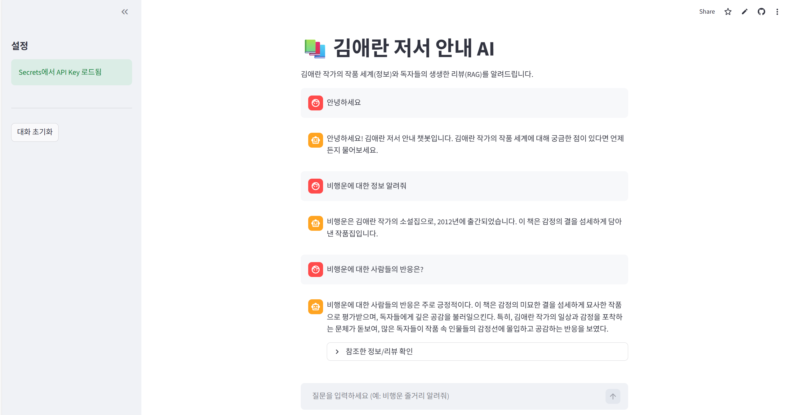
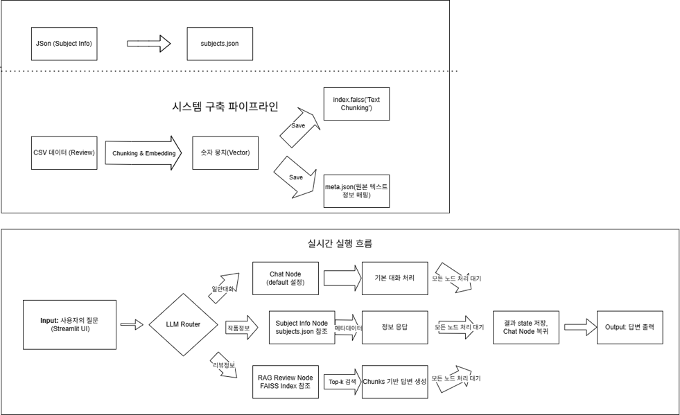

# YBIGTA Team Engineering Project

Team coursework in data collection, analysis, backend development and deployment, completed during YBIGTA's 2026 winter training.

This repository contains two related learning tracks, not one production application:

1. **E-commerce reviews and a FastAPI backend:** review collection and preprocessing, user-management APIs, MySQL/MongoDB integration and Docker deployment.
2. **A book-information assistant:** a separate Streamlit and LangGraph application answering questions about Kim Ae-ran's books using book information and retrieved reviews.

## See the result



The hosted Streamlit demo is no longer publicly accessible: as of September 15, 2026 the app URL redirects to a Streamlit login page. The screenshot above documents the interface. To run the assistant yourself, follow the Book assistant section below; live responses require an Upstage API key.



## Team and contributions

Team members: Yurim Oh, Junhan Chang and Jaehyung Choi. Contributions and review history remain in the repository's commits and pull requests.

**Junhan Chang:** contributed review collection, preprocessing and analysis; backend integration and deployment work; and the later RAG application. This was a team project, not an individually authored product.

## What was built

- Collected 500 reviews each from Enuri, Lotte ON and Emart for coursework; explored review length, ratings, duplicates and word frequencies.
- Implemented a FastAPI application with user-management and review-preprocessing routes.
- Integrated MySQL for user records and MongoDB for review records.
- Packaged the backend in Docker and configured GitHub Actions to build, push and deploy its image to EC2.
- Built a separate book assistant with LLM routing between chat, book information and retrieved reviews. The interface can display retrieved context alongside the answer.

The original Korean coursework write-up, including screenshots and lessons learned, is preserved in [README.coursework.ko.md](README.coursework.ko.md). It is a historical record; use the instructions below for the current entry points.

## Repository map

| Path | Purpose |
| --- | --- |
| `app/` | FastAPI backend, user and review routes |
| `database/` | Database connection modules and coursework data |
| `review_analysis/` | Crawling and review analysis |
| `st_app/` | Book-assistant state, router and nodes |
| `streamlit_app.py` | Book-assistant entry point |
| `test/` | Existing coursework tests |
| `.github/workflows/deploy.yaml` | Docker build and EC2 deployment |
| `aws/` | Demonstration and deployment screenshots |
| `docs/` | Coursework assignment specification (RAG assistant) |

## Local setup

The Dockerfile uses **Python 3.12**. Use a fresh environment; the repository's existing dependency file contains both application and notebook packages.

```bash
python -m venv .venv
# macOS/Linux: source .venv/bin/activate
# Windows PowerShell: .venv\Scripts\Activate.ps1
python -m pip install -r requirements.txt
```

### FastAPI backend

Create a local `.env` with your own development database settings:

```dotenv
MYSQL_USER=your_user
MYSQL_PASSWORD=your_password
MYSQL_HOST=localhost
MYSQL_PORT=3306
MYSQL_DB=your_database
MONGO_URL=mongodb://localhost:27017/your_database
```

MySQL and MongoDB must be available and initialized for the application's routes. The older JSON-only instructions in the coursework archive do not describe the current database-backed application.

From the repository root:

```bash
python -m app.main
```

See `app/config.py` for the application port. The Docker deployment maps port 8000. API documentation is available at `/docs` and the static interface at `/static/index.html`.

### Book assistant

```bash
python -m streamlit run streamlit_app.py
```

The interface accepts an Upstage API key or reads `UPSTAGE_API_KEY` from Streamlit secrets. The review retrieval node also needs its configured local retrieval assets. Keep keys in local secrets or the hosting provider's secret settings; do not commit them.

## Deployment: what the current workflow does

**Deployment status (September 15, 2026):** the project owner confirmed that the EC2 instance has been terminated. Automatic deployment is disabled, and the backend is not currently hosted on that instance. Historical failed runs remain visible: the latest five failed at the deployment job on February 7–8, 2026. [Run history](https://github.com/Junhan1029/YBIGTA_newbie_team_project/actions/workflows/deploy.yaml).

The disabled workflow `.github/workflows/deploy.yaml` is configured to build and push `<DOCKER_USERNAME>/ybigta-backend:latest` on pushes to `main`, then use SSH to replace the EC2 container. It must be re-enabled explicitly after provisioning and validating new infrastructure.

Required GitHub secret names are `DOCKER_USERNAME`, `DOCKER_PASSWORD`, `EC2_HOST`, `EC2_USER` and **`EC2_KEY`**. The SSH command uses a host-side `.env` file via `--env-file .env`.

**The current workflow does not run pytest or a health check before deployment.** Docker build success is not evidence that application tests passed. Earlier coursework prose describing a test gate should not be treated as the current implementation.

## Validation and limitations

- Existing tests are in `test/`. `pytest` is not declared in the current requirements file, so install it separately before attempting `python -m pytest test`.
- A fresh database-backed installation and full test run have not been verified as part of this documentation update.
- The backend and book assistant have different configuration needs. A single dependency file currently mixes notebook, backend and RAG packages; separating them is a follow-up engineering task.
- Crawlers depend on third-party page structure. Coursework review samples are not evidence about all users of a shopping platform.
- This is an educational prototype. Historical screenshots document the project, not a guarantee that cloud infrastructure remains running.
